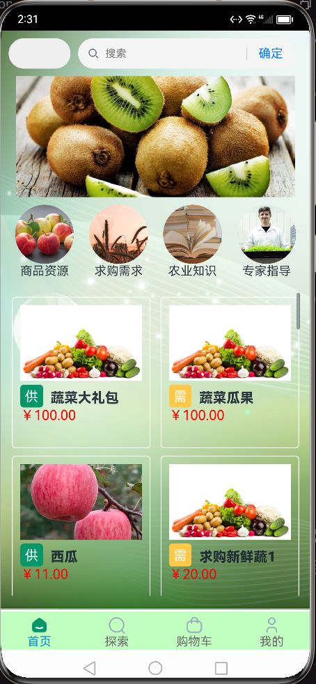
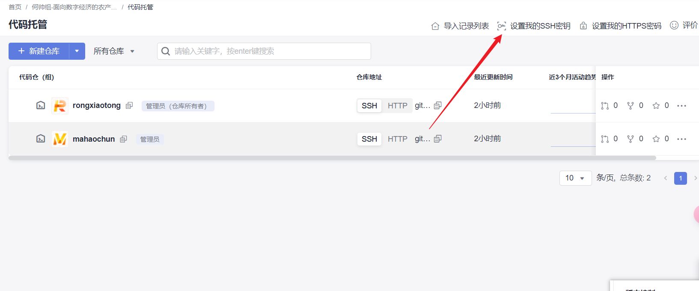
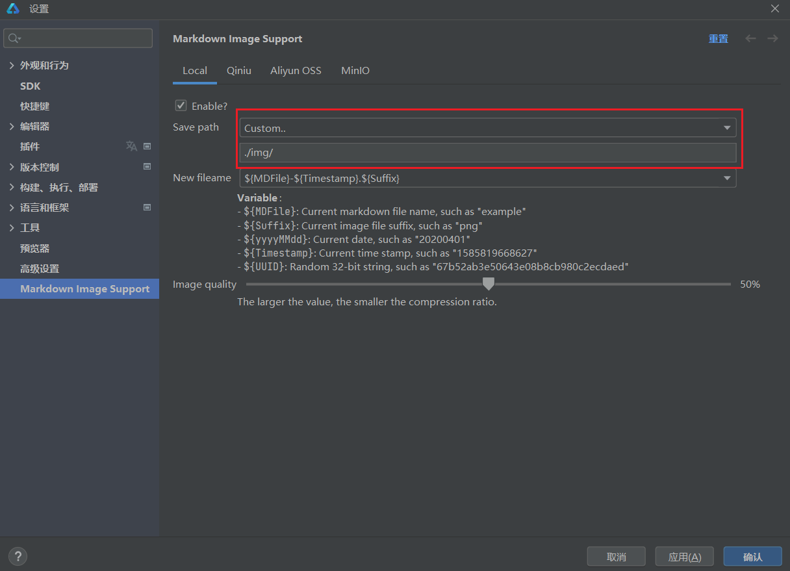
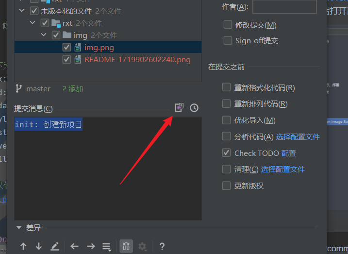
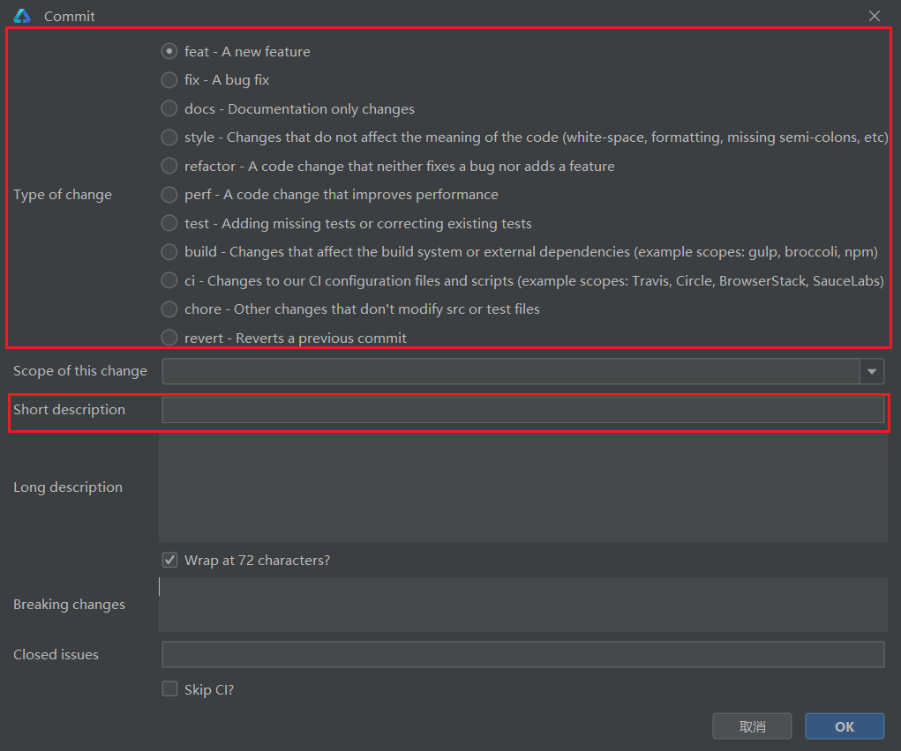
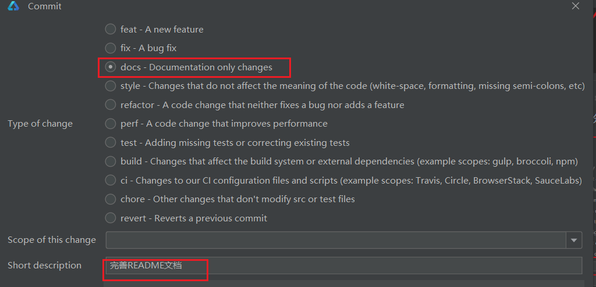

# 融销通
## About/介绍
华为鸿蒙开发-基于数字经济的农产品融销一体化平台
### Preview/预览

### Features/功能
1. 农户可以在平台上进行商品买卖，专家资讯，融资申请。
2. 管理农业知识，处理农业问答信息。
3. 管理员可以管理用户、商品等。
4. ...

## 技术栈
### 后端
springboot+mysql(8.0)+redis(5.x)
### 前端
鸿蒙ArkTs（SDK3.1.0,API9）

## Getting Started/开始
1. 下载DevEco Studio 3.1
2. 文件--新建--版本控制中的项目，输入ssh本仓库的ssh链接（https不可用）
3. 需要预先生成ssh公钥和密钥，并将公钥上传到本项目的
   
4. 克隆[.gitignore](.gitignore)项目后，可正常编写代码
### constraint/约定
1. 本项目的任何文档的图片文件（视频文件），都放置于同目录下的img目录。比如本README文件处于根目录，需要将对应的图片文件放置于根目录的img目录下。  
> 可以借助插件markdown-image-support
> https://plugins.jetbrains.com/plugin/14097-markdown-image-support/versions#tabs  
> 安装后打开设置


2. 采用commitizen git cimmit规范，格式如下。  
```
type(scope) : subject
```
> 以下为简单示例，一般情况下，我们省略scope，只写type和subject
```
feat: 完成首页
```
```
fix: 修复首页中存在的部分bug
```

> 以下为一些常用的commit类型
- fix: 修复bug
- add: 新功能
- update: 更新
- style : 代码格式改变
- test: 增加测试代码
- revert: 撤销上一次的commit
- build: 构建工具或构建过程等的变动，如：gulp 换成了 webpack，webpack 升级等

> 可以借助Git Commit Template这个插件在Idea中实现便利地
> https://plugins.jetbrains.com/plugin/9861-git-commit-template/versions  
> 
> 红框部分为我们必须填写的部分。
> 
> 以下为一个示例
> 


## Contributing/贡献
本项目为闭源项目，参阅[Getting Started/开始](#Getting Started/开始)

## Roadmap/路线图
> 本项目是一个练习项目，做完大致功能后就会归档，因此不考虑路线图。  
## Thanks/鸣谢
1. QST青软实训
2. DevEco Studio
3. CodeArts
4. U+平台